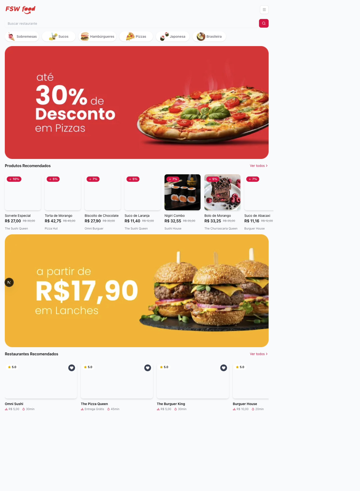
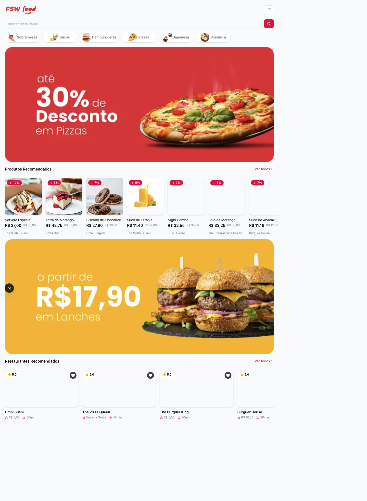
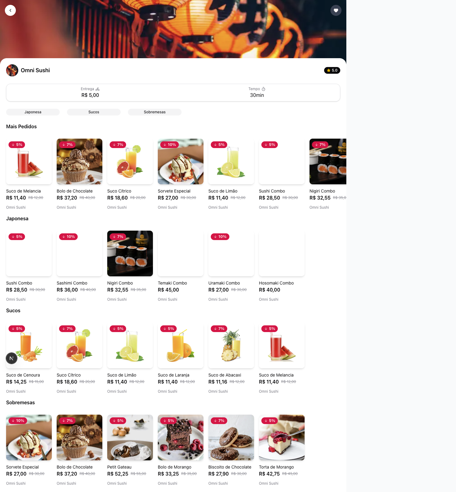

# FSW Food

Aplicação web de delivery desenvolvida com Next.js, Prisma e autenticação via Google.

O projeto simula a jornada completa de um app de pedidos: descoberta de restaurantes, visualização de produtos, carrinho, finalização e acompanhamento de pedidos.

## Preview

### Home



### Meus pedidos



### Restaurante



## Funcionalidades

- Listagem de categorias, produtos e restaurantes recomendados
- Busca de restaurantes
- Página de detalhes do restaurante com catálogo por categoria
- Página de detalhes do produto
- Carrinho de compras
- Fluxo de criação e acompanhamento de pedidos
- Área "Meus pedidos"
- Autenticação com Google (NextAuth)

## Stack

- Next.js 16 (App Router)
- React 19
- TypeScript
- Prisma + PostgreSQL
- NextAuth.js
- Tailwind CSS 4
- Radix UI + componentes utilitários

## Como rodar localmente

### 1. Clone o repositório

```bash
git clone <url-do-repositorio>
cd fsw-food
```

### 2. Instale as dependências

```bash
pnpm install
```

### 3. Configure as variáveis de ambiente

Crie um arquivo `.env` na raiz com os valores abaixo:

```env
DATABASE_URL=""

NEXTAUTH_URL="http://localhost:3000"
NEXTAUTH_SECRET=""

GOOGLE_ID=""
GOOGLE_SECRET=""
```

### 4. Gere o client do Prisma e aplique as migrações

```bash
pnpm prisma generate
pnpm prisma migrate dev
pnpm prisma db seed
```

### 5. Inicie o projeto

```bash
pnpm dev
```

Abra `http://localhost:3000` no navegador.

## Scripts úteis

```bash
pnpm dev      # ambiente de desenvolvimento
pnpm build    # build de produção
pnpm start    # inicia build de produção
pnpm lint     # lint do projeto
```

## Estrutura de pastas (resumo)

```text
app/           # páginas e rotas da aplicação
components/    # componentes compartilhados
lib/           # integrações (auth, prisma, utils)
prisma/        # schema, migrations e seed
public/        # arquivos estáticos
```

## Autor

Projeto desenvolvido por Felipe Bezerra como vitrine de estudo e evolução em desenvolvimento full stack.
